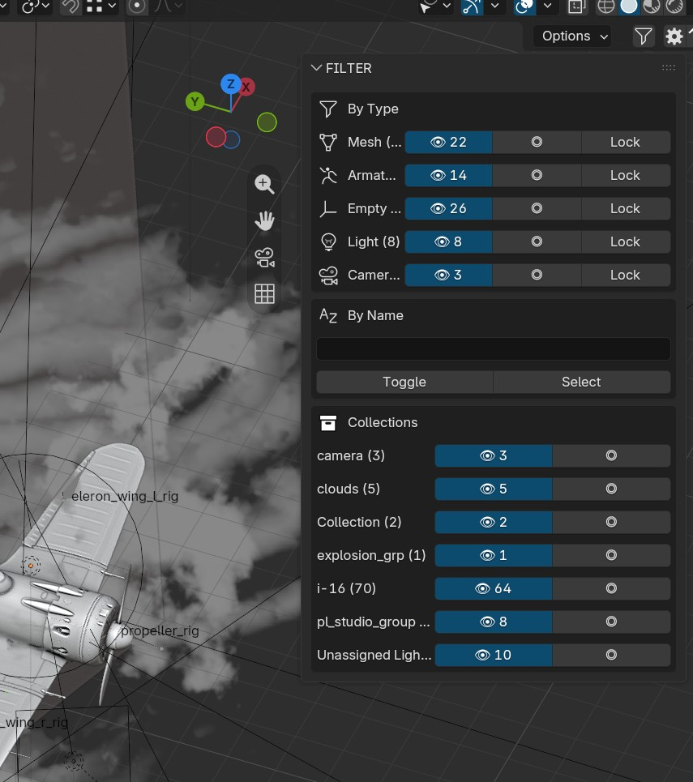

# FILTER

Blender extension for quick object visibility and modifier management.

## Features

- Toggle visibility by object type (Mesh, Armature, Empty, Light, Camera)
- Lock selection per type
- Filter by name pattern (case-insensitive)
- Filter by collection
- **By Modifier** — bulk manage modifiers across the scene: detect every modifier grouped by exact name or by type, with **Scene / Selected** scope toggle
  - Bulk **Apply** with order-safe semantics: if the modifier is not first in a stack, modifiers above it are baked top-down first, so the result stays exactly the same (confirmation dialog appears only when such baking is needed)
  - Bulk **Remove** and **Select** per modifier group
  - Linked duplicates (Alt+D): shared mesh data is made single-user automatically before apply
  - Library-linked objects are skipped

## Installation

### Blender 4.2+ (Extension)

1. Download `filter.zip` from [Releases](../../releases)
2. Blender → Preferences → Get Extensions → Install from Disk → select `filter.zip`

### Blender 3.0+ (Addon)

1. Download `filter.zip` from [Releases](../../releases)
2. Blender → Preferences → Add-ons → Install → select `filter.zip`

## Usage

1. Open Sidebar (N) → **FILTER** tab
2. Use buttons next to each type to toggle visibility, select, or lock
3. Enter name pattern and click Toggle/Select to filter by name

## Build

```bash
cd work
zip -r ../out/filter.zip object_filter/
```

## Screenshot



## License

GPL-3.0-or-later


---

## 🔗 Related Tools

| Tool | Description |
|------|-------------|
| [STUKACH](https://github.com/abyrvalg379/STUKACH) | Pipeline asset validator for Blender |
| [LAMPOCHKA](https://github.com/abyrvalg379/LAMPOCHKA) | Scene light manager |
| [Switch_UDIM](https://github.com/abyrvalg379/Switch_UDIM) | Single ↔ UDIM texture switcher |
| [FLOMASTER](https://github.com/abyrvalg379/FLOMASTER) | OCIO launcher for DCC apps |
| [KARUSELKA](https://github.com/abyrvalg379/karuselka) | Fast camera turntable rig: orbit or object spin |
