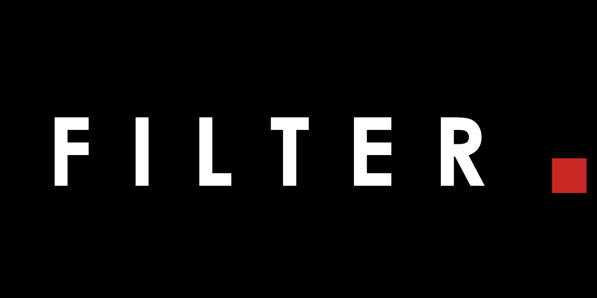
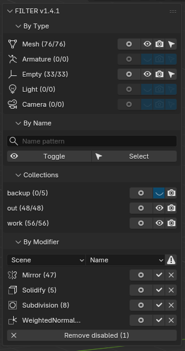

# FILTER



Расширение Blender для быстрого управления видимостью объектов и модификаторами.

*English documentation: [README.md](README.md)*

## Возможности

- Переключение видимости по типу объекта (Mesh, Armature, Empty, Light, Camera)
- **Solo-глаз** — Shift+Клик: показать только этот тип или коллекцию, спрятать всё остальное
- **Render-глаз** — исключить тип или коллекцию из рендера, не трогая вьюпорт
- Блокировка выделения по типу
- Фильтр по шаблону имени (без учёта регистра)
- Фильтр по коллекции
- **By Modifier** — массовое управление модификаторами по всей сцене: находит все модификаторы, сгруппированные по точному имени или по типу, с переключателем скоупа **Scene / Selected**
  - Массовый **Apply** с order-safe семантикой: если модификатор не первый в стаке, модификаторы выше него сначала запекаются сверху вниз — результат остаётся точно таким же (диалог подтверждения появляется только когда запекание нужно)
  - Массовые **Remove** и **Select** по группе модификаторов
  - **Remove disabled** — один клик удаляет все выключенные во вьюпорте модификаторы в скоупе
  - **Детектор расхождения настроек** — находит выбивающихся в группе модификаторов («3 с другими настройками») и выделяет их
  - Связанные дубликаты (Alt+D): общий меш-датаблок автоматически делается single-user перед apply
  - Объекты из linked-библиотек пропускаются
- Сворачиваемые секции (нативные суб-панели)

## Установка

### Blender 4.2+ (Extension)

1. Скачайте `filter.zip` со страницы [Releases](../../releases)
2. Blender → Preferences → Get Extensions → Install from Disk → выберите `filter.zip`

### Blender 3.0+ (Addon)

1. Скачайте `filter.zip` со страницы [Releases](../../releases)
2. Blender → Preferences → Add-ons → Install → выберите `filter.zip`

## Использование

1. Откройте сайдбар (N) → вкладка **FILTER**
2. Кнопки рядом с каждым типом переключают видимость, выделение или блокировку
3. Введите шаблон имени и нажмите Toggle/Select для фильтра по имени

## Сборка

```bash
cd work
zip -r ../out/filter.zip object_filter/
```

## Скриншот



## Лицензия

GPL-3.0-or-later


---

## 🔗 Связанные инструменты

| Инструмент | Описание |
|------|-------------|
| [STUKACH](https://github.com/abyrvalg379/STUKACH) | Пайплайн-валидатор ассетов для Blender |
| [LAMPOCHKA](https://github.com/abyrvalg379/LAMPOCHKA) | Менеджер света сцены |
| [Switch_UDIM](https://github.com/abyrvalg379/Switch_UDIM) | Переключатель текстур Single ↔ UDIM |
| [FLOMASTER](https://github.com/abyrvalg379/FLOMASTER) | OCIO-лаунчер для DCC |
| [KARUSELKA](https://github.com/abyrvalg379/karuselka) | Быстрый турнтейбл-риг: орбита или спин объекта |
